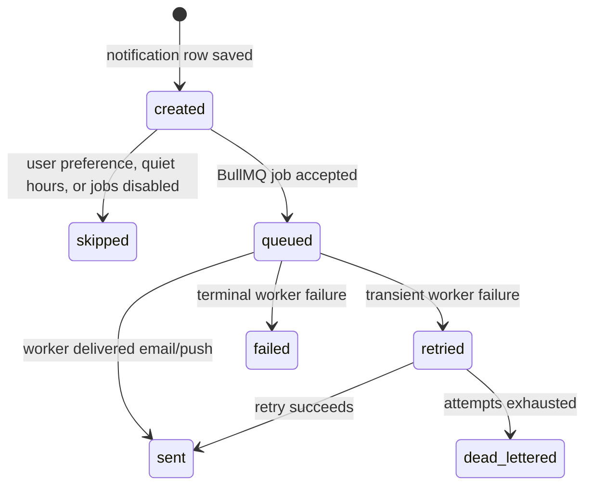

# Notification Delivery Reliability

Issue #1695 defines notification delivery as an observable state machine rather
than a best-effort side effect.

## Delivery States



State meanings:

- `created`: the in-app notification exists and can be synced after reconnect.
- `queued`: Redis/BullMQ accepted async delivery.
- `sent`: the worker completed delivery.
- `skipped`: delivery was intentionally not enqueued, for example
  `ENABLE_BACKGROUND_JOBS=false` or channel preferences disabled.
- `failed`: processing failed and may be retried.
- `retried`: BullMQ scheduled another attempt.
- `dead-lettered`: attempts are exhausted and the DLQ admin endpoint can inspect
  or replay the job.

## Disabled Background Jobs

When `ENABLE_BACKGROUND_JOBS` is anything other than `"true"`, Redis-backed
delivery is disabled by design. The app still creates in-app notifications, logs
explicit skipped delivery, increments `notification_delivery_skipped_total`, and
marks outbox dispatches `SKIPPED` instead of pretending they were delivered.

Sample readiness excerpt:

```json
{
  "backgroundJobMode": "disabled",
  "subsystems": [
    { "name": "redis", "status": "disabled" },
    { "name": "queues", "status": "disabled" }
  ]
}
```

## Idempotency

Notification rows use a nullable `sourceKey` generated from
`userId:type:sourceId`, where `sourceId` comes from `sourceEventId`,
`messageId`, `commentId`, or `reactionId`. The database has a partial unique
index on non-null source keys, and the service returns the existing notification
when a duplicate source event is replayed.

## Reconnect Sync

The notification gateway joins authenticated clients to `user:<id>` only. On
connect and subscription confirmation it emits `notifications:sync` with the
latest unread notifications and unread count, so a websocket reconnect does not
depend on replaying every missed socket event.

## Diagnostics

Failed async jobs are visible through the existing admin DLQ endpoints:

- `GET /admin/notifications/dlq`
- `POST /admin/notifications/dlq/:jobId/replay`

Outbox rows now distinguish `PENDING`, `PROCESSING`, `COMPLETED`, `SKIPPED`,
and `FAILED`.
